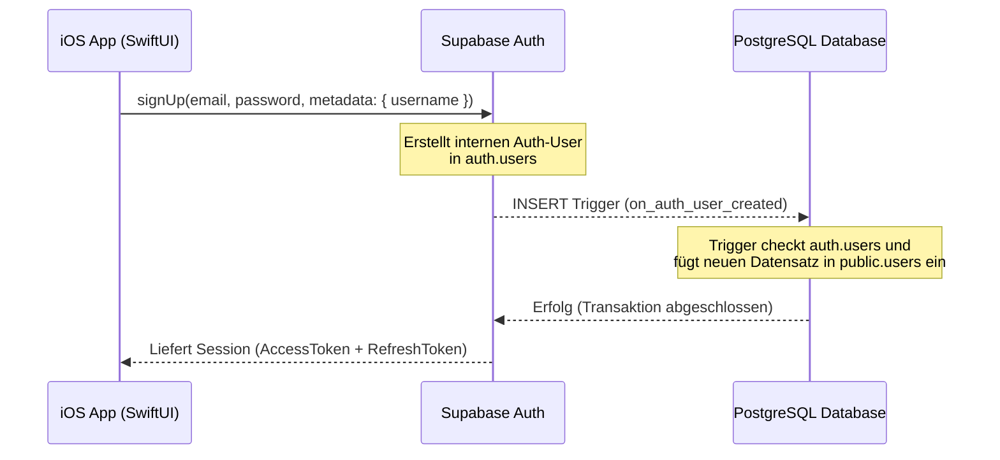

# Benutzerauthentifizierung: Supabase Auth

Dieses Dokument beschreibt die Authentifizierungs-Architektur der **1% Methode**-App unter Verwendung von **Supabase Auth** und **SwiftUI**.

---

## 1. Registrierungs- & Profilerstellungs-Workflow

Die Registrierung nutzt ein zweistufiges Verfahren, um Datenkonsistenz und Sicherheit zu gewährleisten:



1. **Client-Anfrage:** Die App ruft die Methode `supabase.auth.signUp(...)` auf.
2. **Datenbank-Trigger:** Supabase feuert serverseitig einen Trigger `on_auth_user_created` nach dem Einfügen in die Tabelle `auth.users`.
3. **Profil-Synchronisation:** Die Funktion `public.handle_new_user()` füllt die Tabelle `public.users` automatisch mit der `id`, `email` und dem `username` aus den Metadaten.
4. **Sicherheit:** Der Client hat keinen Schreibzugriff auf sensible Identitätsdaten; die gesamte Registrierungstransaktion wird transaktionssicher serverseitig gekapselt.

---

## 2. Row-Level Security (RLS) & Datenschutz

Nach erfolgreicher Anmeldung authentifizieren sich alle API-Aufrufe des iOS-Clients mittels eines JSON Web Tokens (JWT). In der PostgreSQL-Datenbank steuert dieses Token, welche Datensätze sichtbar sind.

### Sicherheitsregeln für verknüpfte Tabellen
Jede Tabelle (`seasons`, `daily_metrics`, `progress_history`) enthält eine Fremdschlüsselspalte `user_id`, die auf `public.users.id` verweist. Die RLS-Richtlinien verhindern, dass ein Nutzer fremde Daten abfragt:

```sql
-- Richtlinie für tägliche Snapshots
create policy "Benutzer können ihre täglichen Metriken verwalten"
  on public.daily_metrics for all
  using (auth.uid() = user_id);
```

> [!IMPORTANT]
> `auth.uid()` ist eine von Supabase bereitgestellte PostgreSQL-Funktion, die die UUID des aktuell angemeldeten Benutzers aus dem HTTP-Header extrahiert. Dadurch wird ein Spoofing (Fälschen der `user_id` im Request) vollständig ausgeschlossen.

---

## 3. Implementierung in SwiftUI

Das Routing wird dezentral im `RootView` gesteuert, welches den Zustand des `AuthService` beobachtet:

```swift
public enum AuthSessionState: Equatable {
    case loading
    case unauthenticated
    case authenticated(userId: UUID, email: String, username: String)
}
```

### Der AuthService-Statusbaum
* **`.loading`:** Zeigt einen eleganten Splash-Screen mit Monospace-Ladeanzeige.
* **`.unauthenticated`:** Leitet auf den `AuthView` um, wo der Nutzer sich registrieren oder anmelden kann.
* **`.authenticated`:** Blendet das `DashboardView` ein. Alle Unteransichten haben über die Umgebung (`@EnvironmentObject`) Zugriff auf Benutzerdetails und die Logout-Funktion.

### Taktiles Feedback bei der Anmeldung
Die Eingabe-Buttons nutzen eine Federphysik (`stiffness: 100, damping: 20`) und skalieren beim Antippen leicht herunter, um ein physisch greifbares Klickgefühl zu geben:

```swift
struct TactileButtonStyle: ButtonStyle {
    func makeBody(configuration: Configuration) -> some View {
        configuration.label
            .scaleEffect(configuration.isPressed ? 0.98 : 1.0)
            .animation(.interactiveSpring(response: 0.15, dampingFraction: 0.8), value: configuration.isPressed)
    }
}
```
