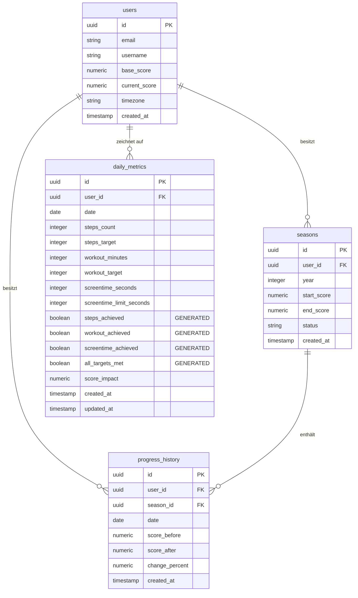

# Supabase Datenbankschema: 1% Methode

Dieses Dokument beschreibt das relationale Datenbankschema für die **1% Methode**-App. Die Datenbank läuft auf **Supabase (PostgreSQL)**. 

Um Reibungsverluste für den Benutzer zu minimieren, wird die Auswertung der täglichen Metriken durch **generierte Spalten (Generated Columns)** direkt auf Datenbankebene durchgeführt.

---

## Architektur-Übersicht

Das Schema besteht aus vier Kernbereichen:
1. **Benutzerverwaltung (`users`)**: Spiegelt die `auth.users`-Tabelle von Supabase Auth wider und speichert die aktuellen Capability-Scores.
2. **Saison-Tracking (`seasons`)**: Setzt den jährlichen Reset-Mechanismus um (FIFA-Loop).
3. **Tägliche Metriken (`daily_metrics`)**: Speichert automatisierte Sensor- und Aktivitätsdaten (HealthKit, Screen Time).
4. **Verlauf (`progress_history`)**: Dokumentiert den täglichen Zinseszins-Effekt der Gewohnheiten.



---

## Tabellenbeschreibung

### 1. `users`
Diese Tabelle hält die Profildaten der Benutzer. Sie ist über einen Fremdschlüssel an die interne Tabelle `auth.users` von Supabase gebunden. Ein Trigger sorgt dafür, dass bei einer neuen Registrierung automatisch ein Eintrag in `public.users` erzeugt wird.

| Spalte | Typ | Beschreibung |
| :--- | :--- | :--- |
| `id` | `uuid` (PK) | Verweis auf `auth.users.id` (On Delete Cascade). |
| `email` | `text` | E-Mail-Adresse des Benutzers (Cache). |
| `username` | `text` | Benutzername (wird aus Metadaten oder E-Mail extrahiert). |
| `base_score` | `numeric(10,4)` | Der anfängliche Score des Benutzers (Standard: `100.0000`). |
| `current_score`| `numeric(10,4)` | Der aktuell berechnete Gesamt-Capability-Score des Nutzers. |
| `timezone` | `text` | Standard-Zeitzone des Nutzers (Standard: `'Europe/Berlin'`). |
| `created_at` | `timestamptz` | Erstellungszeitpunkt in UTC. |

### 2. `seasons`
Repräsentiert ein Kalenderjahr für einen Benutzer. Ermöglicht den **Saison-Reset (FIFA-Loop)** am 31. Dezember.

| Spalte | Typ | Beschreibung |
| :--- | :--- | :--- |
| `id` | `uuid` (PK) | Eindeutige ID der Saison. |
| `user_id` | `uuid` (FK) | Fremdschlüssel zu `public.users.id`. |
| `year` | `integer` | Das jeweilige Kalenderjahr (z.B. `2026`). |
| `start_score` | `numeric(10,4)` | Der Basis-Score zu Beginn des Jahres (das "neue Null"). |
| `end_score` | `numeric(10,4)` | Der End-Score am Jahresende (31. Dezember). |
| `status` | `text` | Status der Saison (`active` oder `completed`). |
| `created_at` | `timestamptz` | Erstellungszeitpunkt. |

> [!NOTE]
> Die Kombination `(user_id, year)` ist eindeutig (`UNIQUE`). Ein Benutzer kann also nur eine Saison pro Kalenderjahr aktiv bespielen.

### 3. `daily_metrics`
Speichert die täglichen automatischen Synchronisationen von Schritten, Trainingsminuten und Bildschirmzeit.

| Spalte | Typ | Beschreibung |
| :--- | :--- | :--- |
| `id` | `uuid` (PK) | Eindeutige ID des Eintrags. |
| `user_id` | `uuid` (FK) | Fremdschlüssel zu `public.users.id`. |
| `date` | `date` | Das Datum des Snapshots (Standard: `CURRENT_DATE`). |
| `steps_count` | `integer` | Per HealthKit erfasste Schritte. |
| `steps_target` | `integer` | Das Schrittziel (Standard: `10000`). |
| `workout_minutes`| `integer` | Per HealthKit erfasste Trainingsminuten. |
| `workout_target`| `integer` | Das Trainingsziel in Minuten (Standard: `30`). |
| `screentime_seconds`| `integer` | Per Screen Time API gemessene Nutzung (in Sekunden). |
| `screentime_limit_seconds`| `integer` | Das maximale Bildschirmzeitlimit (Standard: `7200` = 2 Stunden). |
| **`steps_achieved`** | `boolean` | **Generiert:** `steps_count >= steps_target`. |
| **`workout_achieved`**| `boolean` | **Generiert:** `workout_minutes >= workout_target`. |
| **`screentime_achieved`**| `boolean` | **Generiert:** `screentime_seconds <= screentime_limit_seconds`. |
| **`all_targets_met`**| `boolean` | **Generiert:** `steps_achieved AND workout_achieved AND screentime_achieved`. |
| `score_impact` | `numeric(5,2)`| Prozentuale Auswirkung des Tages auf den Score (z.B. `+1.00` oder `-1.00`). |

> [!IMPORTANT]
> Da `steps_achieved`, `workout_achieved`, `screentime_achieved` und `all_targets_met` als `GENERATED ALWAYS AS ... STORED` definiert sind, wird die Erfolgsprüfung direkt von PostgreSQL durchgeführt. Dies vermeidet Rundungsfehler und Inkonsistenzen zwischen Client und Server.

### 4. `progress_history`
Dokumentiert die täglichen Zinseszins-Änderungen des Gesamt-Scores.

| Spalte | Typ | Beschreibung |
| :--- | :--- | :--- |
| `id` | `uuid` (PK) | Eindeutige ID des Verlaufspunkts. |
| `user_id` | `uuid` (FK) | Fremdschlüssel zu `public.users.id`. |
| `season_id` | `uuid` (FK) | Fremdschlüssel zu `public.seasons.id`. |
| `date` | `date` | Datum des Log-Eintrags. |
| `score_before` | `numeric(10,4)` | Score vor der täglichen Änderung. |
| `score_after` | `numeric(10,4)` | Score nach der täglichen Änderung. |
| `change_percent`| `numeric(5,2)` | Prozentuale Änderung (z.B. `1.00` oder `-1.00`). |

---

## Row-Level Security (RLS) & Sicherheitspolitik

Um die Daten der Nutzer vor unberechtigten Zugriffen zu schützen, ist auf allen Tabellen Row-Level Security aktiviert. Da Supabase-Clients direkt mit PostgREST kommunizieren, greifen diese Regeln direkt bei jeder Query:

```sql
-- Aktivierung von RLS
alter table public.users enable row level security;
alter table public.seasons enable row level security;
alter table public.daily_metrics enable row level security;
alter table public.progress_history enable row level security;

-- Beispiel-Richtlinie für daily_metrics
create policy "Benutzer können ihre täglichen Metriken verwalten"
  on public.daily_metrics for all
  using (auth.uid() = user_id);
```

Dadurch wird serverseitig garantiert, dass ein authentifizierter Benutzer ausschließlich lesenden und schreibenden Zugriff auf Datensätze hat, die seiner eigenen `user_id` zugeordnet sind.
