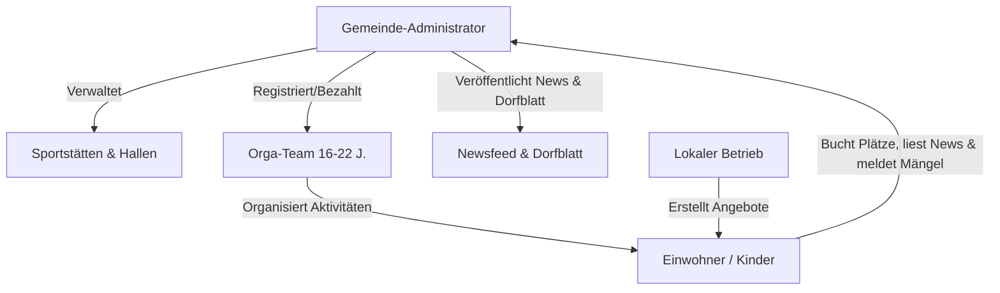

# Comonut – Digitales Dorf- & Stadtleben 🥥

Comonut ist eine innovative, kostengünstige B2G/B2C-Plattform für Gemeinden (Dörfer, Städte und Kommunen), die das Gemeinschaftsleben revitalisiert, die Jugendförderung digitalisiert, Bürger informiert und die lokale Wirtschaft stärkt.

---

## 1. Die Vision: Warum Comonut?

In modernen Gemeinden lässt sich ein deutlicher Rückgang spontaner und organisierter Gemeinschaftsaktivitäten beobachten. Öffentliche Sportplätze liegen oft brach, Kinder verbringen ihre Freizeit zunehmend vor Bildschirmen und lokale Kleinstbetriebe verlieren an Sichtbarkeit.

Comonut löst diese Probleme durch eine dreifache Synergie:
1. **Aktivierung brachliegender Ressourcen:** Einfache Koordination und Buchung von Sportstätten und Hallen.
2. **Jugendförderung durch „Orga-Teams“:** Jugendliche (16–22 Jahre) übernehmen Verantwortung und bieten Aktivitäten für Kinder an.
3. **Lokale Wirtschaftsintegration:** Lokale Betriebe erhalten eine Plattform, um Angebote und Aktivitäten sichtbar zu machen.
4. **Digitale Dorfmitte:** Ein zentraler Informationshub für alle Generationen im Dorf.

---

## 2. Geschäftsmodell & Preisgestaltung
* **Zielgruppe:** Gemeinden, Dörfer und Städte.
* **Preise für Gemeinden:**
  * **Kleine Gemeinde (< 7.500 Einwohner):** 50 €/Monat.
  * **Mittlere Gemeinde (7.500+ Einwohner):** 200 €/Monat.
  * **Große Gemeinde (12.500+ Einwohner):** 300 €/Monat.
* **Einnahmen durch Gewerbe:**
  * Kostenloses Basisprofil für lokale Betriebe.
  * **Sichtbarkeits-Boost:** 1 € pro Tag, um Aktionen oder Coupons im Tab "Shoppen" hervorzuheben.
* **Mehrwert für die Gemeinde:** Höhere Lebensqualität, aktive Jugendförderung, bessere Auslastung öffentlicher Infrastruktur, Stärkung des lokalen Gewerbes. Das Wochenblatt wird digitalisiert, wodurch die Gemeinde Druckkosten einsparen und neue digitale Abonnements über die App vertreiben kann.

---

## 3. Die 4 Benutzerrollen

### A. Gemeinde-Administrator (Municipal Admin)
* Pflegt öffentliche Sportstätten, Hallen und Plätze ein.
* Verwaltet die Accounts der Orga-Team-Mitglieder.
* Veröffentlicht offizielle Mitteilungen im Dorf-Newsfeed und lädt das Dorfblatt (PDF) hoch.
* Bearbeitet Mängelmeldungen und passt das App-Branding (Farben, Logo) an die Corporate Identity der Stadt an.

### B. Orga-Team-Mitglied (16–22 Jahre)
* Erhält einen Minijob/Aufwandsentschädigung von der Gemeinde.
* Verwaltet die Schlüssel für Hallen/Plätze (Haftung liegt über die Gemeinde abgesichert).
* Erstellt offizielle Aktivitäten (z. B. "Mittwochs-Kicken", "Geräteturnen am Freitag").
* Sorgt für Ordnung vor Ort und ist Ansprechpartner für Kinder.

### C. Einwohner (Residents / Kinder & Jugendliche)
* Sehen freie Sportplätze und offizielle/private Aktivitäten.
* Tragen sich für Aktivitäten ein oder erstellen eigene Spielrunden (z. B. "Volleyball um 16 Uhr").
* Reichen Entwürfe für das Schwarze Brett ein (z. B. Katze entlaufen) zur Freigabe durch die Admins.
* Lesen den Newsfeed und das digitale Dorfblatt, erhalten Abfall-Erinnerungen und melden Mängel.
* Können bei Reisen flexibel zwischen verschiedenen Gemeinden in der App wechseln.

### D. Lokaler Betrieb (Local Business)
* Erstellt ein Profil (z. B. Eisdiele, Fahrradwerkstatt, Pizzeria, Kino).
* Schaltet Aktionen (z. B. "2 Kugeln Eis für 2 €") oder verlost Gutscheine.
* Veröffentlicht Schülerjobs, Praktika oder Aushilfsstellen für Jugendliche im Dorf.

---

## 4. Kernfunktionen & Interface-Struktur

Die App verwendet ein einheitliches, übersichtliches Interface mit **4 Haupt-Tabs** für alle Altersgruppen:

### Tab 1: Info (Schwarzes Brett & Mängelmelder)
* **Offizieller Dorf-Newsfeed:** Nachrichten direkt aus dem Rathaus (Baustellen, Ergebnisse, Notfall-Push bei Unwettern).
* **Schwarzes Brett (Moderiert):** Beiträge von Vereinen und Betrieben sind direkt sichtbar. Einwohner können eigene Beiträge (z. B. Flohmarkt, vermisste Tiere) entwerfen. Diese werden erst nach Prüfung durch einen Administrator freigeschaltet (Spam-Schutz).
* **Mängelmelder („Sag's uns“):** Schäden (Schlagloch, kaputte Laterne) per Foto und GPS direkt ans Bauamt melden, inklusive Status-Verfolgung.

### Tab 2: Wochenblatt (Digitales Dorfblatt)
* **PDF-Archiv:** Die wöchentlichen/monatlichen gedruckten Ausgaben zum Download und Durchblättern.
* **Artikel-Ansicht (Mobile First):** Die wichtigsten Artikel des Dorfblatts in einer lesbaren, mobil optimierten App-Ansicht.
* **Volltextsuche:** Durchsuchen aller vergangenen Ausgaben des Dorfblatts.

### Tab 3: Aktivitäten (Platzbelegungs- & Aktivitätsfinder)
* **Platzbuchung & Spielersuche („Volleyball-Effekt“):** Einwohner können eintragen, wann sie auf einem Platz sind (*"Ich spiele ab 16 Uhr Beachvolleyball – wer macht mit?"*). Andere sehen dies und tragen sich ein.
* **Orga-Team-Angebote:** Offizielle Termine, die von den Jugendlichen betreut werden. Eltern sehen transparent, wer die Aufsicht hat.
* **Schnittstellen-Erweiterung (Zukunft):** Unterstützung von RFID-Schlüsseln/Tokens zur digitalen Verknüpfung mit den Orga-Team-Mitgliedern.

### Tab 4: Shoppen (Lokale Angebote & Gewinnspiele)
* **Lokale Gutscheine & Coupons:** Zeitlich begrenzte Schnäppchen von Bäckern, Eisdielen und Restaurants (z. B. 2 Kugeln Eis für 2 €).
* **Gamification („Orga-Punkte“):** Jugendliche sammeln Punkte bei Sportaktivitäten und lösen diese bei Betrieben im Dorf gegen Gutscheine ein.
* **Lokale Jobbörse:** Praktika, Ferienjobs und Aushilfsstellen für Jugendliche vor Ort.

---

## 5. Rechtliche & administrative Klärungen

* **Haftung & Jugendschutz:** Die Gemeinde sichert die Aktivitäten des Orga-Teams rechtlich über ihre kommunale Haftpflichtversicherung ab. Jugendliche erhalten vorab eine kurze Schulung (z. B. Erste Hilfe / Juleica). Eltern der teilnehmenden Kinder unterzeichnen bei der Erstregistrierung eine digitale Einverständniserklärung in der App.
* **Schlüsselgewalt:** Die physische Organisation und Haftung der Schlüssel liegt bei der Gemeinde. Die App dient nicht zur Türöffnung, kann aber zur Nachverfolgung von Übergaben genutzt werden.
* **Custom Branding:** Die Gemeinde-Admins können die Primär- und Sekundärfarben der App für ihre Stadt anpassen (z. B. Gelb/Schwarz für 89155 Erbach passend zum gelben Schloss).
* **Multi-City Roaming:** Einwohner sind nicht an eine Gemeinde gebunden. Sie können jederzeit in der App die Stadt wechseln, um Angebote oder Events im Nachbarort zu sehen.
* **Konnektivität:** Reines Online-Modell. Um die App-Entwicklung zu vereinfachen, setzt die App eine aktive Internetverbindung voraus; bei Funklöchern erscheint ein Ladebildschirm/Fehlermeldung.

---

## 6. Technische Architektur

* **Frontend:** SPA / PWA mit **React / Vite** (schnelles Laden, installierbar auf dem Smartphone).
* **Styling:** Premium UI/UX Design mit Vanilla CSS. Modernes Farbschema, das sich dynamisch an die Gemeindefarbe anpasst.
* **Backend & Echtzeit-Datenbank:** **Firebase** (Firestore für News, Bookings, Deals & Mängel; Auth für Rollen; Cloud Messaging für Müllwecker/Notfall-Push; Storage für Dorfblatt-PDFs).
* **Kosten-Optimierung:** Effiziente Firestore-Querys mit Caching und Paginierung, um Lese- und Schreibzugriffe zu minimieren und Serverkosten niedrig zu halten.
